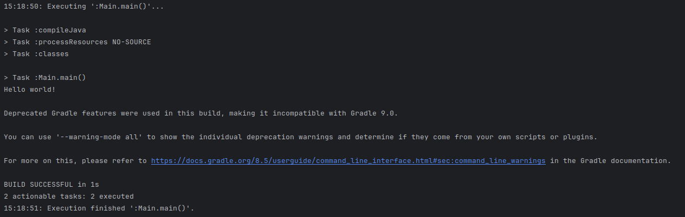

# Java Build Tools, Primitive Data Types, Classes and Members

## Learning Objectives

- Use IntelliJ as an IDE
- Build and compile a simple Java app without gradle
- Build and compile a simple Java app with gradle
- Explain what primitive data types are
- Build a simple Java program using primitive data types
- Build a simple Java program using strings
- Declare class members and assign them primitive values

## Installation

### Install Java 21 SDK

Go to [here](https://learn.microsoft.com/en-us/java/openjdk/download#openjdk-21) and download the appropriate version of the Java SDK for your machine (we are specifically targeting version 21 of the JDK). If you use other versions of the JDK you may encounter problems so it is recommended that you just use version 21 for your platform.

There are Platform specific installation instructions [here](https://learn.microsoft.com/en-us/java/openjdk/install).

To test which version your system can see, start a new Git Bash/Terminal and run `java --version` the output should look something like this:

```bash
openjdk 21.0.3 2024-04-16 LTS
OpenJDK Runtime Environment Microsoft-9388422 (build 21.0.3+9-LTS)
OpenJDK 64-Bit Server VM Microsoft-9388422 (build 21.0.3+9-LTS, mixed mode, sharing)
```

The final numbers aren't important, as long as you're seeing `openjdk 21` at the beginning.

In theory that's enough to begin developing java programs.

Create a new folder somewhere and add a new file to it called `Hello.java`

Open `Hello.java` in a text editor such as VS Code. Add the following code to it (don't worry about what it does yet).

```java
public class Hello {
  public static void main(String[] args) {
    System.out.println("Hello! Is this thing on?");
  }
}
```

Save the file.

Open a Terminal/Git Bash in the folder where the file is saved.

At the command line type `javac Hello.java` and hit enter.

If this is successful it will compile the file to java bytecode (the special instruction set that the Java Virtual Machine understands) and output a new file called `Hello.class`.

To run the code type `java Hello`

If it was successful then you should see the message you placed in the string output to the terminal.


Try changing the message, saving the file again, recompiling it and then running the code once more.

We could do all of our coding in VS Code again, there are lots of plugins etc that will help with development, but we are going to use a dedicated Java IDE instead which has additional tools that we can benefit from using.

### Install IntelliJ Community Edition

Go to the IntelliJ section on the Jetbrains website [here](https://www.jetbrains.com/idea/download/), make sure the correct Operating System is chosen and then download the **Community Edition** of the IDE. For Windows and Mac this downloads an installer that you run to install the application. Note: For now select the Community Edition so that you don't have to worry about licenses etc, and we are all using the same edition of the IDE. If you have an academic email address (ie for a University) you may be able to get 12 month free license for the Ultimate Edition, or if you are going to work for a company they may provide you with a license.

Launch the application once it has been installed. The latest version has a new GUI which is in Beta, you can switch this off or on by opening the Settings dialogue from the File menu, finding the **New UI** option under **Appearances & Behavior** and unticking the box next to **Enable new UI**. At least initially I am going to use the UI but if it proves too flaky for general use I may switch back to the old one.

Initially for most of the activities you will be cloning an existing project and using that so all of the Java setup will already be in place, but to ensure that everything is working as we want we're going to set up a new project in IntelliJ with the required settings. When you first run IntelliJ you will see something that looks similar to this:


The part that is on the right, on the lower part of the window will show you recent projects once you have some.

When we start cloning projects from GitHub you will be able to use the `Get from VCS` button to do so directly inside of IntelliJ, but for now click on the `New Project` button to create a project from scratch.

You should see something like this, which will have various options:


The Location shows the folder which your new project's folder will be created inside of (there is a path underneath explaining where and what the project will be called). Try changing the name to be `hello-project` and it will change the path accordingly.

Leave the `Create Git repository` option ticked, make sure the language is set to `Java`, and choose `Gradle` for the Build system.

Where it says `JDK` clicking on the drop-down will show all of the Java installations that IntelliJ has detected on your machine, make sure this is set to the version of Java which you downloaded earlier (in this case 21.0.3 but your version number may be slightly different).

Choose `Groovy` for the `Gradle DSL` and choose to leave the `Add sample code` box ticked for now.

Click on the arrow to open the `Advanced Settings` section, and for the GroupID option change it to read `com.booleanuk` which should give you something like the following settings:


Once you're happy with the options click on `Create`.

The code that results (from the sample code option) is very similar to the code we had before:


The green in the file names is to do with Git and whether they're new files that have no yet been staged at all. Files that we have previously added but have now updated will show in blue. Once they've been staged and committed the filename will turn white (or whatever default colour you have set up).

The very faint `>` to the right of the green triangle (with the old UI it is a `+`) on line 4 is to indicate that the existing code has actually been folded to make it more readable/confuse new developers, clicking on it will expand the class/method to show all of the code.


The green triangle shows potential entry points for running the code that has been created. If you click on either of the ones on lines 3 or 4 it will run the code, you can also run it by clicking on the green triangle at the top of the window to the right of where it says `Current File`. This option will run the selection that is currently being shown in the drop-down menu, so if a different option is showing it won't necessarily run what you are looking at. If you right-click in the main code window there will also normally be an option to run the code from there too.

We can run the code we have as the class (more on this later) contains a special method (and this will also be discussed later) called `main` that serves as an `entry point` into our program. The `main()` method along with `System.out.println()` are the easiest way for you to be able to see what is happening in your code (they are Java's equivalent to `console.log()` in JavaScript to some extent). When we run tests on our code later on it won't normally be testing the `main()` method, but you can use it as a way to check what is happening for yourself.

Run the file using one fo the methods discussed, and you should see a `Run` window open at the bottom of the screen which eventually (after Java finishes compiling the file) will have the output of the program running. Change the message to be output and rerun the code (the compilation should take less time) and then see the output (if you see the old message again you probably forgot to save the file).

### Deprecation Warning

Currently, when you run the code you will probably see something that looks like this:



This shows you various bits of information about the code you're running along with the output (in this case the line **Hello world!**) and then a message about Deprecated Gradle features being used. This does not affect the success or failure of the code you have written and can safely be ignored for now. When Gradle finally upgrades to version 9.0, IntelliJ will be updated and the default `build.gradle` file will be updated as well to remove this warning, we will look at `build.gradle` and various other aspects of this later in the course. 

For now do not worry when this message is displayed, you have not made a mistake!