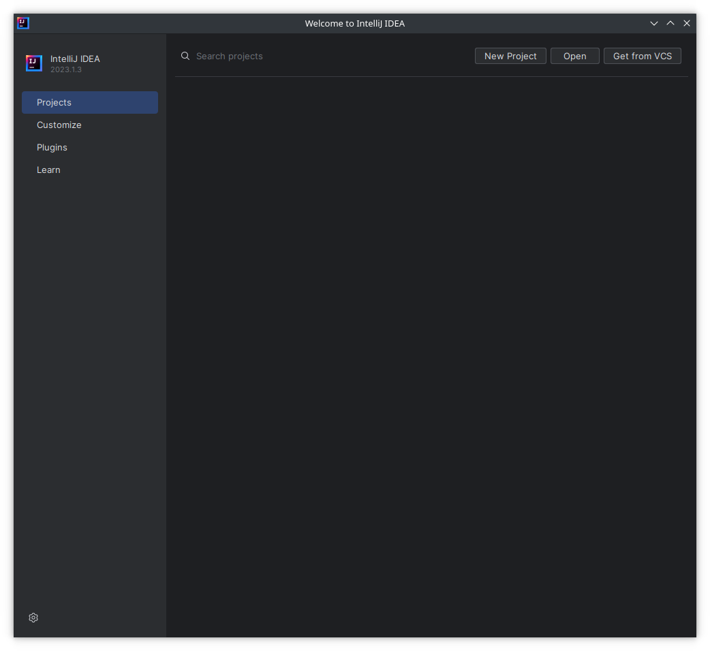
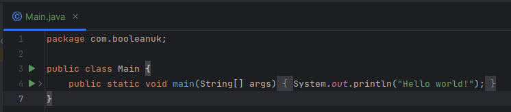
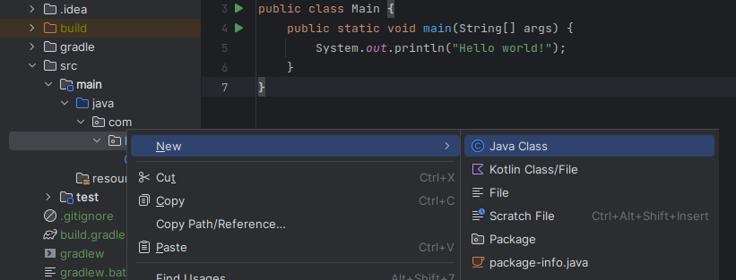

# Java Build Tools, Primitive Data Types, Classes and Members

## Learning Objectives

- Use IntelliJ as an IDE
- Build and compile a simple Java app without gradle
- Build and compile a simple Java app with gradle
- Explain what primitive data types are
- Build a simple Java program using primitive data types
- Build a simple Java program using strings
- Declare class members and assign them primitive values

## Installation

### Install Java 17 SDK

Go to [here](https://learn.microsoft.com/en-us/java/openjdk/download#openjdk-17) and download the appropriate version of the Java SDK for your machine (we are specifically targetting versiion 17 of the JDK). If you use other versions of the JDK you may encounter problems so it is recommended that you just use version 17 for your platform.

There are Platform specific installation instructions [here](https://learn.microsoft.com/en-us/java/openjdk/install).

To test which version your system can see, start a new Git Bash/Terminal and run `java --version` the output should look something like this:

```bash
openjdk 17.0.9 2023-10-17 LTS
OpenJDK Runtime Environment Microsoft-8526870 (build 17.0.9-LTS)
OpenJDK 64-Bit Server VM Microsoft-8526870 (build 17.0.9-LTS, mixed mode, sharing)
```

The final numbers aren't important, as long as you're seeing `openjdk 17` at the beginning.

In theory that's enough to begin developing java programs.

Create a new folder somewhere and add a new file to it called `Hello.java`

Open `Hello.java` in a text editor such as VS Code. Add the following code to it (don't worry about what it does yet).

```java
public class Hello {
  public static void main(String[] args) {
    System.out.println("Hello! Is this thing on?");
  }
}
```

Save the file.

Open a Terminal/Git Bash in the folder where the file is saved.

At the command line type `javac Hello.java` and hit enter.

If this is successful it will compile the file to java bytecode (the special instruction set that the Java Virtual Machine understands) and output a new file called `Hello.class`.

To run the code type `java Hello`

If it was successful then you should see the message you placed in the string output to the terminal.


Try changing the message, saving the file again, recompiling it and then running the code once more.

We could do all of our coding in VS Code again, there are lots of plugins etc that will help with development, but we are going to use a dedicated Java IDE instead which has additional tools that we can benefit from using.

### Install IntelliJ Community Edition

Go to the IntelliJ section on the Jetbrains website [here](https://www.jetbrains.com/idea/download/), make sure the correct Operating System is chosen and then download the **Community Edition** of the IDE. For Windows and Mac this downloads an installer that you run to install the application. Note: For now select the Community Edition so that you don't have to worry about licenses etc, and we are all using the same edition of the IDE. If you have an academic email address (ie for a University) you may be able to get 12 month free license for the Ultimate Edition, or if you are going to work for a company they may provide you with a license.

Launch the application once it has been installed. The latest version has a new GUI which is in Beta, you can switch this off or on by opening the Settings dialogue from the File menu, finding the **New UI** option under **Appearances & Behavior** and unticking the box next to **Enable new UI**. At least initially I am going to use the UI but if it proves too flaky for general use I may switch back to the old one.

Initially for most of the activities you will be cloning an existing project and using that so all of the Java setup will already be in place, but to ensure that everything is working as we want we're going to set up a new project in IntelliJ with the required settings. When you first run IntelliJ you will see something that looks similar to this:



The part that is on the right, on the lower part of the window will show you recent projects once you have some.

When we start cloning projects from GitHub you will be able to use the `Get from VCS` button to do so directly inside of IntelliJ, but for now click on the `New Project` button to create a project from scratch.

You should see something like this, which will have various options:


The Location shows the folder which your new project's folder will be created inside of (there is a path underneath explaining where and what the project will be called). Try changing the name to be `hello-project` and it will change the path accordingly.

Leave the `Create Git repository` option ticked, make sure the language is set to `Java`, and choose `Gradle` for the Build system.

Where it says `JDK` clicking on the drop-down will show all of the Java installations that IntelliJ has detected on your machine, make sure this is set to the version of Java which you downloaded earlier (in this case 18.0.2 but your version number may be slightly different).

Choose `Groovy` for the `Gradle DSL` and choose to leave the `Add sample code` box ticked for now.

Click on the arrow to open the `Advanced Settings` section, and for the GroupID option change it to read `com.booleanuk` which should give you something like the following settings:


Once you're happy with the options click on `Create`.

The code that results (from the sample code option) is very similar to the code we had before:



The green in the file names is to do with Git and whether they're new files that have no yet been staged at all. Files that we have previously added but have now updated will show in blue. Once they've been staged and committed the filename will turn white (or whatever default colour you have set up).

The very faint `>` to the right of the green triangle (with the old UI it is a `+`) on line 4 is to indicate that the existing code has actually been folded to make it more readable/confuse new developers, clicking on it will expand the class/method to show all of the code.


The green triangle shows potential entry points for running the code that has been created. If you click on either of the ones on lines 3 or 4 it will run the code, you can also run it by clicking on the green triangle at the top of the window to the right of where it says `Current File`. This option will run the selection that is currently being shown in the drop-down menu, so if a different option is showing it won't necessarily run what you are looking at. If you right-click in the main code window there will also normally be an option to run the code from there too.

We can run the code we have as the class (more on this later) contains a special method (and this will also be discussed later) called `main` that serves as an `entry point` into our program. The `main()` method along with `System.out.println()` are the easiest way for you to be able to see what is happening in your code (they are Java's equivalent to `console.log()` in JavaScript to some extent). When we run tests on our code later on it won't normally be testing the `main()` method, but you can use it as a way to check what is happening for yourself.

Run the file using one fo the methods discussed, and you should see a `Run` window open at the bottom of the screen which eventually (after Java finishes compiling the file) will have the output of the program running. Change the message to be output and rerun the code (the compilation should take less time) and then see the output (if you see the old message again you probably forgot to save the file).

## Primitive Data Types

Unlike languages like JavaScript which use something called **Duck Typing** Java insists that you decide what data type a particular variable or object is when you declare it and makes sure that value or object that will be assigned to it matches this data type (Object-Oriented Programming offers a way to sort of circumvent this), whilst this can feel a little restrictive to begin with it does help avoid runtime bugs and other problems which can be tricky to find.

If we want to declare a variable called score that is going to hold an integer (whole number) then we can do the declaration on one line without assigning a value to it.

`int score;`

The line of code **must** end with a semicolon `;` which is what tells Java the code on that line is complete.

Add the above line to our hello world program above and then add another line that says `System.out.println(score);` below it so that the code looks like this:

```java
package com.booleanuk;

public class Main {
    public static void main(String[] args) {
        System.out.println("Hello world!");

        int score;

        System.out.println(score);
    }
}
```

If you try and run the code you will get an error message telling you that:

`error: variable score might not have been initialized System.out.println(score);`

this is Java **helping** you avoid bugs.

You can assign a value to `score` either on the same line it is declared on so that it reads `int score = 1000;` or on a line after it has been declared so that it reads `score = 1000;`. Try both of these ways of initialising the `score` variable (do one run it, then do the other). We can also assign the value on the line where it is declared and then change it on another line to a different value before outputting it.

`int` is one of the primitive data types that comes with Java out of the box. Primitive data types are common ones that we will use repeatedly (and that you have used in Javascript possibly without knowing it). The others are shown below:

| Data Type | Examples                               | Purpose                                                                                      |
|-----------|----------------------------------------|----------------------------------------------------------------------------------------------|
| boolean   | `true`, `false`                        | Answer yes or no questions                                                                   |
| byte      | `-128`, `0`, `20`, `127`               | Store whole numbers from -128 to 127                                                         |
| short     | `-32768`, `0`, `20`, `32767`           | Store whole numbers from -32768 to 32767                                                     |
| int       | `-2000000000`, `0`, `20`, `2000000000` | Store whole numbers from -2147483648 to 2147483647                                           |
| long      | `-2L`, `0L`, `20L`, `2L`               | Store whole numbers from -9223372036854775808 to 9223372036854775808                         |
| float     | `-5.91f`, `0.29f`, `2.19f`, `5.67f`    | Store fractional numbers from 3.4e−038 to 3.4e+038                                           |
| double    | `-19.99d`, `0.29d`, `2.19d`, `5.67d`   | Store fractional numbers from 1.7e−308 to 1.7e+308. They have double the precision of floats |
| char      | `'A', 'B', 'C'`                        | Store a single character (notice chars us a single quote mark)                               |

We can declare and initialise (assign a value to) them in the same way we did with `score` above.

Add a variable declaration for each to the code you already have and also a `System.out.println()` statement to show each one.

The one variable type we don't have here is the String (a collection of text), in Java a String is a different type of variable called a **Reference Type** currently we don't need to worry about the difference, but be aware that each of the Primitive Types shown above also have a **Reference Type** version that we will also need to use in specific circumstances. For instance the **Reference Type** version of an `int` is an `Integer` and we may need to use that in certain circumstances. **Reference Types** tend to have names which begin with a capital letter and when we get on to defining our own classes we will essentially be defining our own **Reference Types**. Converting between the two types (Primitive and Reference Types) is called autoboxing or unboxing depending on which way the conversion goes and is something that the Java compiler does for you.

Add a line to declare and initialise a new `String` variable called name, with your name assigned to it and then on a separate line add in the following code:

```
System.out.println("Hello " + name + " how are you?");
```

Note that where `char`s have a single quote mark around them `'`, `String`s have to have double quote marks around them `"`.

Strings also have lots of useful methods we can call on them such as `name.length()` or `name.toUpperCase()` here are some useful reference guides:

- [W3Schools](https://www.w3schools.com/java/java_ref_string.asp)
- [Oracle Java Documentation](https://docs.oracle.com/en/java/javase/18/docs/api/java.base/java/lang/String.html#method-summary)

## Classes and Members

Everything in Java lives inside classes, we'll discuss defining our own objects later but for now if you think of a class as having state and behaviour, then we can think of the state as being the data that is stored inside instances of the class and behaviour as being the methods (functions) we will define as being part of the class (this will all become clearer later). At the moment we can create a class to use such as an `Album` as follows. Right-click on the folder that the `Main` class file is contained in (probably called `booleanuk`) and select `New` then `Java Class`. Give it the name Album and IntelliJ will create the stub of the class as follows.



```java
package com.booleanuk;

public class Album {
    
}
```

The keyword public needs to go at the start of a class definition like this for reasons that we will go into at a later point. This code equates to us saying we want to define a public class called `Album` and then we are going to define any variables it contains between the curly brackets.

The `package` line tells Java that this is part of the same package as the `Main` class and will become essential when we come to defining and running tests later.

Let's add some variables and assign values to them as we go (we'll come back to other ways to initialise the values at a later point).

```java
package com.booleanuk;

public class Album {
    String title = "Dark Side of the Moon";
    String artist = "Pink Floyd";
    int year = 1973;
    String genre = "Progressive Rock";
    boolean bandStillPerforming = true; // I'm unclear if they are still performing or not.
}
```

At the moment you can't run the code for this file as there is no entry point. To add one we need to add a `main()` method similar to the one we had previously. Inside that method we need to create a new instance of the Album class, and then we will be able to access the values stored in its variables.

```java
package com.booleanuk;

public class Album {
    String title = "Dark Side of the Moon";
    String artist = "Pink Floyd";
    int year = 1973;
    String genre = "Progressive Rock";
    boolean bandStillPerforming = true; // I'm unclear if they are still performing or not.

    public static void main(String[] args) {
        Album pinkFloydAlbum = new Album();
        System.out.println("Title: " + pinkFloydAlbum.title);
        System.out.println("Artist: " + pinkFloydAlbum.artist);
        System.out.println("Year: " + pinkFloydAlbum.year);
        System.out.println("Genre: " + pinkFloydAlbum.genre);
        System.out.println("Still performing: " + pinkFloydAlbum.bandStillPerforming);
    }
}
```

`main()` declared in this special way (`public static void` and with an argument of `String[] args` tells Java that this is an entry point).

Counter-intuitively you then instantiate an instance of the class inside itself, which will then give you access to it. You often don't need a `main()` method as you will be interacting with your classes from other classes. If you have a big program with lots of classes in it, then often you would make a `Main` class with a `main()` method that would be the starting point for everything else running in your project (ie the first class would be instantiated in there and run everything else).

Right click in the code window for the `Album` class and select the run option to run it, if you've done everything correctly you should see the 5 lines of output show in the Run window.

You can also create an instance of the `Album` class in the `Main` class and output some data there (at this point it is available without any problem because they are both in the `com.booleanuk` package). Go into `Main` and add the code at the bottom of the `main()` method:

```java
package com.booleanuk;

public class Main {
    public static void main(String[] args) {
        System.out.println("Hello world!");

        int score = 2000000000;

        System.out.println(score);

        Album anAlbum = new Album();
        System.out.println(anAlbum.title + " by " + anAlbum.artist);
    }
}
```

This creates a new instance of the `Album` class and then outputs some of the information that it contains. Run the `Main` class `main()` method rather than the `Album` class one to see this in action.

## Running Tests

Many of the early tasks you will be doing will have tests predefined by us, that you will need to make pass in order to pass the Core criteria and then other tests that will test the Extension criteria. Let's add some tests to this project to show you how it will work. Go to the Project browser and make sure the `test` folder is expanded. Then right-click on the **Java** option below `test`


and choose `New` then `Package`.


In the new window that opens give it the name `com.booleanuk` which will add the folder structure to match the main code part (this will let us test the `Album` class).

Then add a new Java class to the `booleanuk` folder we just created called `AlbumTest` and paste the following code into the file that results (we aren't going into what this all means at this point, it is just here so that we can demonstrate using tests in your code):

```java
package com.booleanuk;

import org.junit.jupiter.api.Assertions;
import org.junit.jupiter.api.Test;

public class AlbumTest {

    @Test
    public void nameIsDarkSide() {
        Album theAlbum = new Album();
        Assertions.assertEquals("Dark Side of the Moon", theAlbum.title);
    }

    @Test
    public void artistIsPinkFloyd() {
        Album theAlbum = new Album();
        Assertions.assertEquals("Pink Floyd", theAlbum.artist);
    }
}
```

When you look in the test file you will see a double green triangle to run all of the tests and single green triangles to run each test individually. It is usually easier to run each test individually and fix your code to make that test pass then move onto the next test and repeat this. Once you have worked through all of the tests I would then run all of the tests collectively to make sure that fixing one test hasn't broken another one. Once all the tests are passing then your code is ready to be pushed to GitHub and you can open a Pull Request in the same way that you did before.

Often there will be Core activities and Extension activities too, some of the time these will require solutions to be written into separate files, but as we go on, more and more of them will be testing the same files. When we get further into the course the expectation is that you the student will be creating the tests that exercise your code to test it.

For Test Driven Development the standard workflow is often called **Red Green Refactor** here **Red** involves you as the Developer thinking about the code you want to write and writing a test (or quite often multiple tests) to test this functionality. When you run this test it will fail, so you then write code to make the test pass (the **Green** part of the process). You work through repeating this process until you have created a program to meet your requirements, **Refactoring** your code as you go to make it more readable, maintainable, efficient etc.
